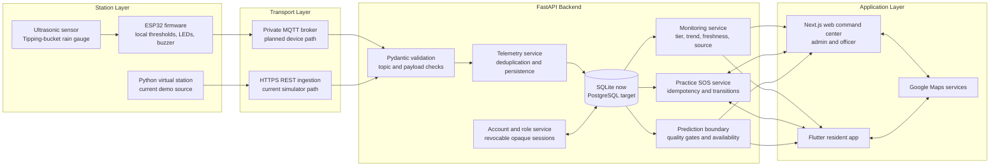
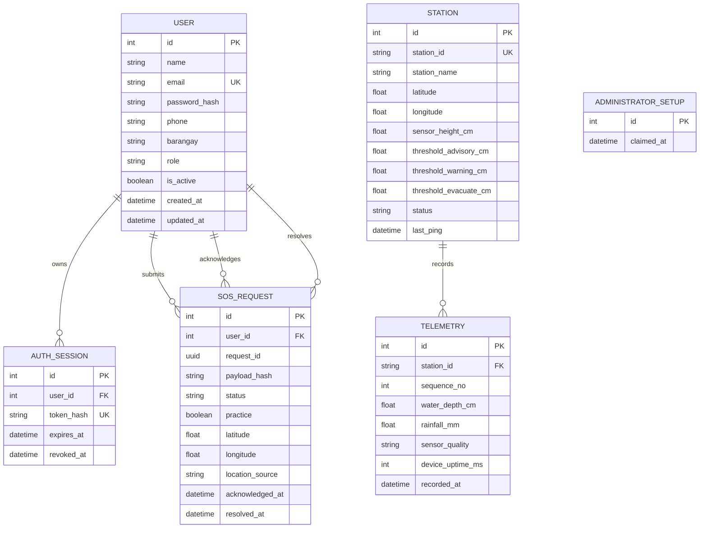
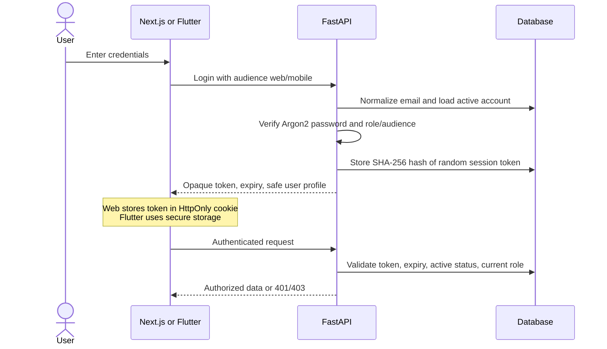
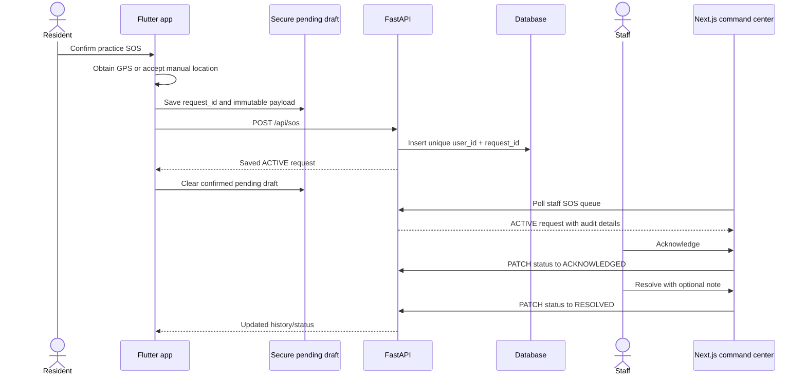

# AGAPAY Master Presentation and Defense Guide

**Prepared for the project leader**  
**Presentation date:** 16 September 2026  
**Current evidence checked through:** 15 September 2026

> [!IMPORTANT]
> Present AGAPAY as a **functional software-first academic prototype**. The current system proves the monitoring, account, map, practice SOS, and prediction-interface workflows with a virtual station. The physical station is not assembled or calibrated yet, and no ML model has been trained. That distinction makes the project credible.

## 1. The five sentences you must remember

1. **AGAPAY is a hyperlocal community flood monitoring and early-warning prototype for Urdaneta City University and nearby communities.**
2. **It turns station readings into validated records, clear warning tiers, staff dashboards, resident mobile information, evacuation guidance, and a traceable practice SOS workflow.**
3. **The physical station is designed around an ESP32, a waterproof ultrasonic sensor, a tipping-bucket rain gauge, LEDs, a buzzer, and solar power, but the unassembled hardware is currently represented by a virtual station using the same telemetry contract.**
4. **Measured thresholds control the current alert level; future ML forecasts are advisory and can never silently replace measured safety decisions.**
5. **What already works is the software pipeline; the next research phase is physical assembly, calibration, field-data collection, and model training and evaluation.**

If you forget a detailed answer, return to these five sentences.

## 2. Claims you can and cannot make

| Safe statement | Statement to avoid | Why |
| --- | --- | --- |
| “We have a functional software-first prototype.” | “The complete system is deployed.” | The physical station and production infrastructure are not deployed. |
| “A virtual station sends contract-valid telemetry through the live backend.” | “All readings come from real sensors.” | Current presentation data is simulated until hardware assembly. |
| “AGAPAY has an ML-ready prediction interface.” | “Our AI predicts floods accurately.” | No trained model or accuracy result exists yet. |
| “SOS is a persistent practice workflow.” | “SOS dispatches emergency responders.” | It stores, acknowledges, and resolves practice requests only. |
| “The map uses Google Maps and supports station, SOS, and evacuation views.” | “Every route and shelter is officially validated.” | Site points, shelter activation, capacity, and entrance need authority confirmation. |
| “The sample thresholds are 60, 85, and 100 cm.” | “These thresholds are official for every location.” | They must be calibrated per station and waterway geometry. |
| “The web and mobile clients refresh monitoring every five seconds.” | “Every event is pushed instantly.” | Current clients poll; WebSockets and FCM are future work. |
| “The system preserves invalid and stale states.” | “No data means normal.” | Missing, invalid, stale, and safe are different conditions. |
| “The software flow is tested.” | “Field accuracy and endurance are proven.” | Field calibration, weather exposure, solar endurance, and physical-device tests remain. |

## 3. Thirty-second elevator pitch

> Flood information is often too broad or arrives too late to describe the condition of a specific community waterway. AGAPAY is our hyperlocal flood monitoring and early-warning prototype. A station measures water depth and rainfall, the backend validates and stores each reading, and the web and mobile applications show one shared alert level, map location, trend, and recommended response. Residents can also submit a traceable practice SOS with a manual or GPS location. We have completed and tested the software workflow using a virtual station while the physical ESP32 station is still being assembled. The next stage is calibration, field-data collection, and responsible ML training.

## 4. Two-minute opening script

> Good day. We are presenting AGAPAY, a community flood and disaster early-warning prototype designed for Urdaneta City University and nearby communities.
>
> The problem we address is not the absence of national weather information. The problem is the lack of a local, continuously updated view of a specific canal or flood-prone point. A city-wide weather report may warn that rain is heavy, but residents and responders still need to know what is happening at the waterway nearest them.
>
> AGAPAY connects a planned ESP32 monitoring station to a FastAPI backend, a Next.js command-center website, and a Flutter resident application. The station contract carries water depth, rainfall per reporting interval, sensor quality, uptime, firmware version, and a unique sequence number. The backend rejects malformed or duplicate data, stores valid records, separates flood severity from connectivity and sensor health, and provides the same monitoring snapshot to both applications.
>
> Our current prototype is software-first because the physical hardware has not yet been assembled. We therefore built a virtual station that uses the exact contract planned for the device. It lets us demonstrate normal, rising, flash-flood, recovery, sensor-fault, and offline scenarios today without pretending that simulated measurements are field measurements.
>
> The system also includes secure role-based accounts, interactive Google Maps, analytics, and a persistent practice SOS flow with acknowledgement and resolution. We have defined a strict 30-, 60-, and 90-minute prediction interface, but we intentionally do not claim a trained model before we collect suitable calibrated data.
>
> Our contribution is an integrated and testable foundation. Today we will show what works, explain the safety decisions behind it, and identify the exact steps from software validation to a calibrated field prototype.

## 5. Problem, users, and value

### The problem

- National and city-wide forecasts do not always describe the condition at one small local waterway.
- Residents need a simple severity level, recent measurement, trend, location, and action guidance.
- Staff need one view of stations, alert conditions, system health, history, and SOS requests.
- Early prototypes often hide unsafe assumptions by showing stale or invalid data as if it were live.
- A prediction feature can become misleading if a project displays numbers before it has calibrated data and a validated model.

### Primary users

| User | Need | AGAPAY response |
| --- | --- | --- |
| Resident | Understand nearby conditions | Mobile home status, warning tier, history, map, action guidance |
| Resident | Find evacuation guidance | Google map view and walking route to the project’s provisional UCU Gym point |
| Resident | Ask for assistance | Explicit practice SOS with manual or GPS location and status history |
| Officer | Monitor and prioritize | Web dashboard, stations, alerts, analytics, health, and SOS queue |
| Administrator | Manage access | All officer abilities plus staff/resident account management |
| Research team | Validate the system before deployment | Virtual scenarios, strict data contract, test suites, and explicit gaps |

### Value proposition

AGAPAY converts raw local measurements into understandable and auditable information. Its strongest design choice is that one backend defines the meaning of the data, so the web and mobile interfaces do not make independent safety decisions.

## 6. Objectives

### General objective

Design and implement an integrated prototype for hyperlocal flood monitoring, community warning, and coordinated practice emergency reporting.

### Specific objectives

1. Define a consistent station telemetry contract for water depth, rainfall, sensor quality, timing, and device identity.
2. Validate, deduplicate, timestamp, and persist telemetry in a central backend.
3. Compute station-specific warning tiers and trends from measured data.
4. Present consistent monitoring information through a web command center and resident mobile application.
5. Show stations, SOS locations, and evacuation guidance through Google Maps.
6. Provide authenticated, role-based accounts and revocable sessions.
7. Provide an idempotent practice SOS workflow that survives uncertain network responses without creating duplicate requests.
8. Define a safe ML prediction boundary before training, including data-quality gates and explicit unavailable states.
9. Enable software integration testing before physical hardware is available.
10. Establish a clear path to hardware calibration, field-data collection, production security, and deployment.

## 7. Scope and boundaries

### Included now

- One seeded virtual station at the planned UCU irrigation canal area.
- FastAPI validation, persistence, accounts, monitoring snapshots, practice SOS, and prediction availability.
- Next.js command center based on the approved Figma screens.
- Flutter resident application based on the approved Figma screens.
- Google Maps on web and mobile.
- Six telemetry scenarios for repeatable demonstrations.
- Four alert tiers: NORMAL, ADVISORY, WARNING, and EVACUATE.
- Development-only forecast previews that are visibly identified as simulated.

### Designed but awaiting hardware or data

- Physical ultrasonic water-level acquisition.
- Physical tipping-bucket rainfall acquisition and calibration.
- ESP32 field publishing through a private authenticated MQTT broker.
- Outdoor enclosure, solar charging, power endurance, and site installation tests.
- Calibrated station thresholds and exact surveyed coordinates.
- Collection of representative wet-season and event data.
- Model training, comparison, validation, deployment, and monitoring.

### Future production work

- PostgreSQL or Supabase deployment with versioned migrations.
- Device identity, signed or authenticated telemetry, and managed secrets.
- TLS-enabled private MQTT infrastructure.
- WebSockets for server-driven web updates and FCM for mobile push notifications.
- Persistent operational alert records, notification delivery, reports, and audit policy.
- Verified evacuation-center authority, capacity, activation state, and safe entrance data.
- Email verification, MFA, and self-service recovery.
- Official emergency-service integration, which would require governance and operational agreements.

### Outside project scope

- Replacing PAGASA, CDRRMO, or emergency responders.
- Controlling floodgates, irrigation valves, or pumps.
- Water billing.
- Agricultural soil analysis.
- Claiming that an advisory model can issue official evacuation orders.

## 8. System architecture



### How to explain the architecture

Use four layers:

1. **Station layer:** gathers local environmental measurements and keeps local LED/buzzer warnings working even if the network fails.
2. **Transport layer:** MQTT is the intended lightweight device transport; the Python simulator currently uses HTTP to exercise the same backend contract.
3. **Backend layer:** owns validation, persistence, security, alert meaning, freshness, SOS state, and the ML boundary.
4. **Application layer:** the web and mobile apps present the backend’s shared interpretation and use Google Maps for geographic context.

The backend is the source of truth. Clients render the result; they do not invent independent thresholds.

## 9. Why these technologies

| Technology | Role | Reason for selection |
| --- | --- | --- |
| ESP32 + Arduino/PlatformIO | Physical station controller | Affordable, Wi-Fi capable, familiar embedded ecosystem, suitable GPIO support |
| MQTT | Device telemetry transport | Small messages, publish/subscribe pattern, and low overhead for IoT links |
| HTTP REST | Simulator and application APIs | Easy to inspect, test, document, and recover state |
| FastAPI | Backend | Typed Python APIs, Pydantic validation, automatic OpenAPI docs, and a direct path to Python ML adapters |
| SQLAlchemy | Persistence layer | Database abstraction, relationships, transactions, and migration path to PostgreSQL |
| SQLite | Current local database | Zero-service setup for development and demonstrations |
| PostgreSQL/Supabase | Deployment target | Multi-user relational database, stronger concurrent deployment model, backups, and managed hosting options |
| Next.js + React + TypeScript | Staff web command center | Structured routes, server-side account boundary, reusable dashboard components, and type safety |
| Flutter + Dart | Resident mobile app | One codebase for Android/iOS-oriented interfaces with native device services |
| Google Maps | Shared map platform | Familiar gestures, terrain/satellite/hybrid views, 3D on web, markers, and route services |
| Recharts | Web analytics | Clear responsive line and rainfall charts |
| Argon2 + opaque sessions | Account security | Strong password hashing and immediate server-side session revocation |

## 10. End-to-end monitoring flow

1. The station obtains a water-depth measurement and rainfall count.
2. Firmware checks whether the sensor result is valid.
3. If valid, firmware determines the local warning tier and drives the LEDs and buzzer. This local behavior does not depend on Wi-Fi.
4. Firmware packages the reading with `station_id`, a unique `sequence_no`, sensor quality, device uptime, and firmware version.
5. The physical design publishes JSON to `agapay/stations/{station_id}/telemetry` through MQTT. The current virtual station posts the same schema to `/api/telemetry` through HTTP.
6. FastAPI validates syntax and meaning. It rejects unknown fields, impossible ranges, invalid quality/depth combinations, unknown stations, and duplicate sequence numbers.
7. The telemetry service stores the sample. The server adds `recorded_at` in UTC and updates the station’s last ping and firmware version.
8. The monitoring service loads recent samples and computes flood tier, trend, connectivity, staleness, latest sensor quality, last valid depth, and source.
9. Authenticated web and mobile clients request the monitoring snapshot every five seconds.
10. Both interfaces render the same station condition, localize timestamps for Philippine time, and visibly distinguish simulator, device, demo fallback, and no-data states.
11. Forecast panels separately request prediction availability every 30 seconds. Their output is advisory and cannot change the measured tier.

### Physical path versus current demo path

```text
Physical target: Sensors -> ESP32 -> MQTT -> FastAPI -> Database -> Applications
Current demo:    Scenario script -> HTTP -> FastAPI -> Database -> Applications
```

Only the first two transport steps differ. Validation, storage, monitoring, and client rendering are shared. That is why work completed now remains useful after assembly.

## 11. Telemetry contract

### Example valid payload

```json
{
  "station_id": "STATION_001",
  "sequence_no": 3000001,
  "water_depth_cm": 88.4,
  "rainfall_mm": 1.4,
  "sensor_quality": "valid",
  "device_uptime_ms": 427500,
  "firmware_version": "0.1.0"
}
```

### Example invalid-sensor payload

```json
{
  "station_id": "STATION_001",
  "sequence_no": 3000002,
  "water_depth_cm": null,
  "rainfall_mm": 0.0,
  "sensor_quality": "invalid",
  "device_uptime_ms": 437500,
  "firmware_version": "0.1.0"
}
```

### Field meanings and rules

| Field | Meaning | Current validation |
| --- | --- | --- |
| `station_id` | Registered source station | Uppercase letters, digits, `_` or `-`; 3–50 characters |
| `sequence_no` | Per-station message identity | Integer of at least 1; unique together with station ID |
| `water_depth_cm` | Calibrated water depth | 0–1000 cm when valid; `null` when invalid |
| `rainfall_mm` | Rainfall for this reporting interval | 0–1000 mm; not automatically hourly or daily cumulative |
| `sensor_quality` | Whether the depth is trustworthy | Exactly `valid` or `invalid` |
| `device_uptime_ms` | Device uptime | Non-negative integer |
| `firmware_version` | Source firmware identity | Semantic-version format, such as `0.1.0` or `0.2.0-simulator` |
| `recorded_at` | Server receive time | Added by FastAPI in UTC; not sent by the device today |

Unknown JSON fields are forbidden. Battery percentage is intentionally absent until a real measurement circuit is calibrated. Station coordinates are metadata because the station is fixed; they are not repeated in every sample.

### Duplicate prevention

The database makes `(station_id, sequence_no)` unique. The firmware reserves one million sequence numbers for each boot using ESP32 Preferences, reducing normal restart collisions. A repeated pair returns a conflict rather than silently storing the same measurement twice.

## 12. Warning-tier and trend logic

The seeded demonstration station uses these **sample** thresholds:

| Tier | Depth rule | Meaning in the prototype | Physical indicator |
| --- | ---: | --- | --- |
| NORMAL | `< 60 cm` | Routine monitoring | Green LED |
| ADVISORY | `60 to < 85 cm` | Increased awareness | Yellow LED |
| WARNING | `85 to < 100 cm` | High concern and preparation | Yellow LED; orange in apps |
| EVACUATE | `>= 100 cm` | Follow evacuation guidance and authority instructions | Red LED + buzzer |

```text
if depth >= evacuate_threshold: EVACUATE
else if depth >= warning_threshold: WARNING
else if depth >= advisory_threshold: ADVISORY
else: NORMAL
```

The physical station has three LEDs, so ADVISORY and WARNING share yellow. The applications preserve four distinct visual levels.

Trend uses the two most recent valid readings:

| Difference from previous valid reading | Trend |
| ---: | --- |
| `>= 4.0 cm` | Rapidly rising |
| `>= 0.5 cm` | Rising |
| `<= -0.5 cm` | Falling |
| Otherwise | Stable |

These thresholds are prototype defaults. A site survey must establish sensor height, zero reference, channel geometry, official action levels, environmental noise, and safe mounting. Hysteresis or confirmation windows should be added before field deployment to reduce rapid tier switching around a boundary.

## 13. The four states that must remain separate

Do not describe a station with only one word such as “active.” AGAPAY separates:

| Dimension | Examples | Question answered |
| --- | --- | --- |
| Administrative status | active, inactive, maintenance | Should the organization operate this station? |
| Connectivity | online, offline, no data | Is the station communicating recently? |
| Sensor quality | valid, invalid | Can the latest measurement be trusted? |
| Flood severity | NORMAL, ADVISORY, WARNING, EVACUATE | What did the latest valid depth indicate? |

The default stale limit is 30 seconds. If the latest sample is invalid, AGAPAY shows the invalid quality and a `null` latest depth while preserving the last valid depth and tier. If communication becomes stale, it shows offline while preserving the last known severity. It never converts missing data into zero or NORMAL.

This is a central safety argument: **unknown is not safe**.

## 14. Hardware design and current status

### Planned station components

| Component | Purpose | Current status |
| --- | --- | --- |
| ESP32 DevKit V1, 30-pin CP2102 USB-C | Read sensors, apply local thresholds, connect to network | Selected; firmware scaffold exists |
| JSN-SR04T waterproof ultrasonic sensor | Measure distance to water surface | Selected; physical calibration pending |
| Hall/tipping-bucket rain gauge | Convert bucket tips to rainfall | Selected direction; delivered mechanism and calibration pending |
| Green/yellow/red LEDs | Local visible warning | GPIO behavior implemented in firmware scaffold |
| Active buzzer | Local EVACUATE sound | GPIO behavior implemented in firmware scaffold |
| CL638W 6 V/3.8 W solar panel | Energy source | Selected/ordered direction; endurance unverified |
| CN3065 charger, protected 18650 cell, MT3608 | Charging, storage, regulation | Selected/ordered direction; assembled power path unverified |
| IP65 enclosure and PG7 glands | Environmental protection | Selected direction; outdoor validation pending |

### Confirmed GPIO plan

| Signal | GPIO |
| --- | ---: |
| Ultrasonic TRIG | 5 |
| Ultrasonic ECHO | 18 through verified voltage protection |
| Rain pulse | 4 with `INPUT_PULLUP` |
| Buzzer driver | 25 |
| Green LED | 26 |
| Yellow LED | 27 |
| Red LED | 14 |

### How water depth will be calculated

The ultrasonic sensor measures the distance from the mounted sensor to the water surface. After measuring the installed reference geometry:

```text
water_depth_cm = calibrated_sensor_reference_height_cm - measured_air_gap_cm
```

The calculation needs an onsite empty/reference measurement, checks at known water heights, temperature/noise observations, and rejection rules for impossible echoes. The current firmware has not replaced `readSimulatedTelemetry()` with the final sensor driver.

### How rainfall will be calculated

A tipping-bucket gauge produces one pulse for each bucket tip:

```text
rainfall_for_interval_mm = valid_tip_count * calibrated_mm_per_tip
```

Project material uses a nominal `0.70 mm/tip`, but the actual mechanism must be measured before treating that value as calibrated. Debouncing is also required so one physical tip does not count multiple times.

### Local failure behavior

Firmware applies local LEDs and the buzzer before network publishing and continues attempting Wi-Fi/MQTT reconnection without blocking the main loop. Therefore, loss of internet should not disable the station’s local warning. The current PubSubClient publish is QoS 0, so production delivery reliability will require a reviewed broker/device strategy rather than an unsupported guarantee.

## 15. Virtual station

The simulator at `agapay-backend/simulator/simulate_http.py` is a software test instrument. It labels its firmware as `0.2.0-simulator`, allowing the clients to show `SIMULATOR` or `VIRTUAL STATION`.

| Scenario | Demonstrates |
| --- | --- |
| `normal` | Small valid changes below the advisory threshold |
| `rising` | Gradual movement through all warning tiers |
| `flash-flood` | Faster late-stage rise |
| `recovery` | Falling water from evacuation back to normal |
| `sensor-fault` | Invalid `null` depth without falsely showing zero/NORMAL |
| `offline` | Last severity remains visible after communication becomes stale |

The simulator validates integration and user-interface behavior. It does not validate sensor accuracy, mounting, power endurance, or real flood conditions.

## 16. Backend responsibilities

FastAPI currently provides:

- health checking and automatic OpenAPI documentation;
- station registration and lookup;
- strict telemetry validation, deduplication, persistence, latest reading, and history;
- authenticated app-ready monitoring snapshots;
- resident/staff/admin accounts and revocable sessions;
- administrator user management;
- persistent practice SOS submission, read access, GPS update, acknowledgement, and resolution;
- prediction availability and explicit development previews;
- optional MQTT subscriber configuration.

The backend intentionally owns data meaning. If thresholds, freshness, or status logic changed independently in two frontends, users could see conflicting warnings. Centralization prevents that class of inconsistency.

## 17. Database model



`ADMINISTRATOR_SETUP` is a singleton claim that closes first-admin registration permanently after setup. The SOS table also snapshots resident contact/location information so staff can review what was submitted at that time.

No persistent `Alert`, `Prediction`, `Report`, or `EvacuationCenter` table exists yet. Current sensor alerts are derived from the monitoring snapshot, manual web alerts are in memory, forecasts are calculated on request, and shelter data is provisional application data.

## 18. Account and security architecture

### Account flow



### Roles

| Capability | Resident | Officer | Administrator |
| --- | :---: | :---: | :---: |
| Register through resident mobile flow | Yes | No | No |
| View monitoring and advisory forecast | Yes | Yes | Yes |
| Create and view own practice SOS | Yes | No | No |
| View all practice SOS requests | No | Yes | Yes |
| Acknowledge and resolve practice SOS | No | Yes | Yes |
| Use the web command center | No | Yes | Yes |
| Manage users and roles | No | No | Yes |

Public registration always creates a resident; callers cannot inject a staff role. The first local administrator can be created only once. Administrators cannot demote or deactivate themselves. Deactivation, role changes, password changes, and logout revoke affected sessions.

### Security choices

- Passwords are hashed with Argon2 and never returned.
- Sessions use random 256-bit opaque tokens; only SHA-256 token hashes are stored.
- Session lifetime defaults to seven days and can be revoked immediately.
- Next.js keeps the backend token in a same-site HttpOnly cookie behind same-origin route handlers, so browser JavaScript does not read it.
- Flutter stores the token using `flutter_secure_storage`.
- Protected API calls recheck the current database role and active status.
- Account and SOS responses use `Cache-Control: no-store`.
- Login and registration have bounded per-process rate limiting.

Current gaps before public deployment include shared rate limiting, device authentication for telemetry, HTTPS everywhere, secret management, versioned database migrations, email verification, MFA, recovery, backup policy, and security review.

## 19. Practice SOS design

### SOS state machine

```text
ACTIVE -> ACKNOWLEDGED -> RESOLVED
```

Only staff can perform transitions. The order is enforced and repeated transitions are idempotent.

### End-to-end SOS flow



### Why the retry design matters

A network can fail after the server saves a request but before the phone receives the response. Creating a new request during retry could duplicate an emergency record. AGAPAY therefore:

1. generates a UUID `request_id` before sending;
2. saves the exact payload locally before the POST;
3. retries with the same ID and identical payload;
4. makes `(user_id, request_id)` unique;
5. returns the existing request for an identical retry;
6. returns HTTP 409 if the same ID is reused with changed content.

This provides at-most-one logical request for a resident’s submission attempt, even when the response is uncertain.

### Location and privacy behavior

- Residents explicitly choose to use current GPS; manual location remains available.
- Latitude and longitude must appear together.
- Initial GPS data may be at most ten minutes old; live updates use a stricter two-minute rule.
- A foreground-only, opt-in live-sharing mode can update an active request.
- Out-of-order location fixes are rejected.
- Resolution ends updates.
- The app does not claim background tracking.
- Staff see a map only for the coordinates the resident submitted.

### Exact meaning of practice mode

The backend stores the request, its resident snapshot, coordinates, status, actors, times, and resolution note. It does **not** call, text, push, or dispatch real responders. `ACKNOWLEDGED` means a staff user changed the database state; it is not proof of a field response.

## 20. Prediction and ML architecture

### Current prediction contract

- Authenticated endpoint: `GET /api/predictions/{station_id}`.
- Exact horizons: +30, +60, and +90 minutes.
- Statuses: `not_trained`, `insufficient_data`, `stale_data`, `invalid_data`, `available`, and `service_error`.
- Unavailable forecasts return `null`, never a fabricated zero or stale numeric value.
- Every response carries timestamps, source, input status, sample counts, and an advisory-only flag.
- Development preview values are visibly simulated, do not write predictions to the database, and cannot trigger alert tiers.
- The configured predictor is currently `UntrainedPredictor`; empty model placeholder files are never loaded.

### Input quality gates

| Gate | Current provisional rule |
| --- | --- |
| Lookback | Last 60 minutes |
| Maximum rows | 3,600 |
| Minimum valid samples | 12 |
| Minimum time span | 30 minutes |
| Maximum gap | 5 minutes |
| Latest-data age | 120 seconds or less |
| Invalid readings | Any invalid sample rejects the current window |
| Output lifetime | At most 60 seconds |

These are interface safeguards, not proof that they are the final scientific values.

### Future ML flow

```mermaid
flowchart LR
    Calibrate[Calibrate sensors and station geometry] --> Collect[Collect timestamped field data]
    Collect --> Clean[Quality control and event labeling]
    Clean --> Split[Time-based and location-aware train/validation/test split]
    Split --> Baseline[Build persistence and trend baselines]
    Baseline --> Candidates[Train candidate time-series models]
    Candidates --> Evaluate[Evaluate error, warning recall,<br/>false alarms, and lead time]
    Evaluate --> Review[Safety and domain review]
    Review --> Version[Freeze model, scaler, schema, version]
    Version --> Adapter[Implement reviewed Predictor adapter]
    Adapter --> Shadow[Shadow-mode monitoring]
    Shadow --> Advisory[Advisory deployment with drift monitoring]
```



### What data must be fixed before training

1. Add an actual device measurement timestamp; current `recorded_at` is server receive time.
2. Define and record the rainfall interval; current `rainfall_mm` identifies an interval but does not transmit its duration.
3. Calibrate water depth and rain tips against known references.
4. Collect normal, rising, peak, falling, sensor-fault, and network-gap periods.
5. Capture maintenance and sensor-quality metadata so bad periods are excluded intentionally.
6. Obtain enough independent events to test generalization instead of memorizing one simulated pattern.

### Planned evaluation

- Compare every candidate with simple baselines such as “latest depth persists” and linear recent trend.
- Use time-ordered splits to avoid training on future observations.
- Reserve complete flood events for testing when possible.
- Report MAE and RMSE for depth forecasts at each horizon.
- For threshold-crossing usefulness, report recall, precision, false-alarm rate, missed-event rate, and useful lead time.
- Evaluate calibration and stability across stations and seasons.
- Run the model in shadow mode before showing operational advisories.
- Version the model, scaler, input schema, data period, metrics, and limitations.

Do not promise a particular algorithm before the data is inspected. Start with transparent baselines, then compare statistical methods, tree-based regression on engineered lags, and sequence models only if dataset size supports them.

### Safety rule

Measured threshold logic remains authoritative. Forecasts provide additional advisory context; they do not automatically issue an evacuation level. Official action remains with authorities.

## 21. Web command center

The Next.js website follows the 14-screen/dialog Figma page with a dark canvas, navy panels, blue borders, compact cards, fixed navigation, and consistent spacing.

| Route | Purpose | Data status |
| --- | --- | --- |
| `/login` | Staff sign-in | Backend account API |
| `/register` | One-time local first-admin setup | Backend account API; disabled in production |
| `/dashboard` | Summary, station map, alert queue, water chart, threshold tiers | Live backend monitoring or clearly marked fallback demo |
| `/stations` | Station cards and status | Backend monitoring |
| `/stations/STATION_001` | Detailed monitoring, history, map, forecast | Monitoring + prediction APIs |
| `/alerts` | Sensor-derived conditions and manual demonstration alerts | Sensor alerts derived; manual alerts in memory |
| `/sos` | Practice SOS list, maps, acknowledgement, resolution | Persisted backend SOS |
| `/analytics` | Water/rain charts and filtered CSV | Backend telemetry history |
| `/system-health` | Connectivity, staleness, quality, firmware | Backend monitoring |
| `/users` | Create/edit/deactivate accounts | Backend; admin only |
| `/settings` | Profile, password, preferences, information, logout | Account API plus some prototype preferences |

The dashboard’s data-mode label is important:

- `SIMULATOR` means backend data came from the virtual station.
- `LIVE` means backend data exists and firmware does not identify itself as the simulator.
- `NO DATA` means the station has no backend readings.
- `DEMO` means bundled fallback data is shown because the monitoring API is unavailable.

The clients refresh monitoring every five seconds. This is near-live polling, not WebSocket push.

## 22. Resident mobile application

The Flutter application uses the approved dark visual system and the main navigation **Home, Map, SOS, Alerts, Profile**.

### Main flows

- Splash restores a stored account session.
- Login and registration use backend resident accounts.
- Home shows the current tier, water depth, rainfall per interval, trend, freshness, data source, and recent history.
- Map shows the station or provisional evacuation route.
- SOS submits and tracks persisted practice requests.
- Alerts shows current details and notification-style history.
- Profile edits account data, exposes prototype settings, and logs out.
- Forecast panels show availability and clearly label simulated preview values.

### Mobile boundaries

- Notification history is currently sample/in-memory content; FCM is not configured.
- Language selection saves a preference, but complete translated copy has not been supplied.
- Location is requested only after a resident action; no background tracking is claimed.
- A physical phone needs the computer’s reachable LAN API address during local testing.
- Android debug build is verified; physical-device GPS behavior and iOS native execution still require validation.

## 23. Google Maps design

AGAPAY uses one map provider across web and mobile.

### Web map capabilities

- Photorealistic 3D overview centered on Urdaneta City.
- Matching dark vector mode.
- Terrain, satellite, and hybrid map types.
- Pan, zoom, reset, fullscreen, station selection, Street View, and touchpad gestures.
- Staff SOS map for submitted coordinates.
- Graceful loading/error state and external Google Maps link.

### Mobile map capabilities

- Shared Google Maps JavaScript page inside a controlled WebView.
- Station and evacuation markers.
- Resident GPS marker after explicit permission/action.
- Google walking route with returned distance/duration when available.
- SOS coordinate display.

### Map limitations

- Maps require internet and configured Google APIs.
- Browser-visible map keys must be restricted to the required APIs and approved origins; native keys require platform restrictions.
- The station coordinate `15.98165, 120.560573` is a planned UCU irrigation point and needs an onsite survey.
- UCU Gym is a provisional evacuation guide from project references. Activation, safe entrance, capacity, and official route must be confirmed with the responsible authority.
- If the map fails, coordinates and textual status remain available.

## 24. API reference for the defense

| Method and path | Access today | Purpose |
| --- | --- | --- |
| `GET /health` | Public local API | API/database health |
| `GET /api/stations` | Public local API | List stations |
| `GET /api/stations/{station_id}` | Public local API | Station metadata |
| `POST /api/stations` | Public local API | Register station; secure/admin-only before deployment |
| `POST /api/telemetry` | Public local ingest | Validate/store simulator data; device authentication required before deployment |
| `GET /api/telemetry/{station_id}/latest` | Public local API | Latest raw reading |
| `GET /api/telemetry/{station_id}?limit=N` | Public local API | Raw recent history |
| `GET /api/monitoring/stations` | Authenticated user | App-ready station snapshots |
| `GET /api/auth/setup` | Local development | First-admin setup availability |
| `POST /api/auth/setup` | Local, one-time, rate-limited | Create first administrator |
| `POST /api/auth/register` | Public, rate-limited | Create resident |
| `POST /api/auth/login` | Public, rate-limited | Create web/mobile session |
| `GET/PATCH /api/auth/me` | Authenticated user | Read/update own account |
| `POST /api/auth/logout` | Session if present | Revoke session |
| `GET/POST/PATCH /api/users` | Administrator | User administration |
| `POST /api/sos` | Resident | Create idempotent practice SOS |
| `GET /api/sos` | Resident owner or staff view | Paginated practice SOS records |
| `GET /api/sos/{id}` | Owner or staff | One practice SOS |
| `PATCH /api/sos/{id}/location` | Resident owner | Validated foreground location update |
| `PATCH /api/sos/{id}` | Officer/admin | Acknowledge or resolve |
| `GET /api/predictions/{station_id}` | Authenticated user | Forecast availability or development preview |

FastAPI exposes interactive development documentation at `http://127.0.0.1:8000/docs`.

## 25. Current implementation truth table

| Capability | Status | What can be demonstrated |
| --- | --- | --- |
| Figma-based web command center | Implemented | All principal pages, dialogs, navigation, and responsive desktop behavior |
| Flutter resident interface | Implemented | Principal resident screens, navigation, narrow-phone layouts |
| Accounts and roles | Implemented | Register, login, profile, sessions, admin user management |
| Telemetry validation/storage | Implemented | Strict fields, station check, duplicate conflict, history |
| Virtual monitoring station | Implemented | Six repeatable scenarios through real backend/database |
| Monitoring tier/trend/freshness | Implemented | Same snapshot used by web and mobile |
| Google Maps | Implemented with configured online APIs | 3D/vector station map, SOS coordinates, mobile stations/routes |
| Practice SOS | Implemented | Persistent create/read/acknowledge/resolve and safe retry |
| Analytics CSV | Implemented | Filtered telemetry data export |
| ML prediction interface | Implemented | Unavailable states and development previews |
| Trained ML model | Not implemented | Explain contract and training plan only |
| Physical station readings | Not implemented | Show firmware/simulator contract; assemble/calibrate next |
| Push notifications | Not implemented | Explain planned FCM/WebSocket flow |
| Persistent operational alerts/reports | Partial/planned | Sensor state derived now; manual alerts reset on reload |
| Official emergency dispatch | Not implemented | Practice workflow only |
| Production deployment | Not implemented | Explain hardening and migration plan |

## 26. Verification evidence

The latest complete local verification recorded for this presentation is:

| Component | Result |
| --- | --- |
| FastAPI | Full suite: **70 passing tests**; one framework deprecation warning |
| Flutter | `flutter analyze`: **no issues** |
| Flutter | Full suite: **19 passing tests** |
| Flutter | Android debug APK built successfully |
| Next.js | TypeScript check passed |
| Next.js | Production build passed |
| Live browser integration | Dashboard received simulator telemetry, showed one online station, EVACUATE at 112.0 cm, rainfall 5.6 mm/interval, and 26 analytics samples |

These checks support software behavior. They do not support physical accuracy, environmental reliability, production security, or ML performance claims.

## 27. Recommended 10-minute presentation

### Slide 1 — Title and one-sentence purpose (30 seconds)

**Show:** AGAPAY name, logo, team, one system image.  
**Say:**

> AGAPAY is our hyperlocal flood monitoring and community early-warning prototype for Urdaneta City University and nearby communities.

### Slide 2 — Problem and users (45 seconds)

**Show:** local canal/photo or map, resident and officer icons.  
**Say:**

> Broad forecasts remain important, but they may not describe a particular canal. Residents need a clear local condition and action, while staff need one operational view of stations and requests.

### Slide 3 — Objectives and scope (45 seconds)

**Show:** sense, validate, warn, guide, respond.  
**Say:**

> Our objectives are to measure and validate local conditions, convert them into shared warning tiers, show them on web and mobile, support practice SOS coordination, and prepare a safe interface for future forecasting.

### Slide 4 — Architecture (75 seconds)

**Show:** the architecture diagram.  
**Say:**

> The station or simulator sends one strict telemetry contract. FastAPI validates and stores it, computes monitoring state, and serves both clients. The website is for officers and administrators; the mobile app is for residents. Google Maps adds location context. Central backend logic keeps every client consistent.

### Slide 5 — Data and warning logic (60 seconds)

**Show:** payload fields and tier table.  
**Say:**

> Each message contains a station ID, sequence number, water depth, interval rainfall, quality, uptime, and firmware version. The backend rejects malformed or duplicate records. For our seeded demonstration, thresholds are 60, 85, and 100 centimeters, but these are sample values pending site calibration.

### Slide 6 — Current hardware strategy (45 seconds)

**Show:** ESP32, ultrasonic sensor, rain gauge, LEDs, buzzer.  
**Say:**

> The physical design uses an ESP32, waterproof ultrasonic sensing, tipping-bucket rainfall, local indicators, and solar power. It is not assembled yet, so the current firmware and Python virtual station let us validate the software contract first. Physical calibration is the next stage.

### Slide 7 — Web and mobile interfaces (60 seconds)

**Show:** dashboard and mobile home/map.  
**Say:**

> Staff see monitoring, station details, alerts, SOS, analytics, system health, and users. Residents see current conditions, history, map and evacuation guidance, alerts, profile, and practice SOS. Both clients refresh the same backend state every five seconds.

### Slide 8 — Practice SOS and reliability (60 seconds)

**Show:** SOS state flow and idempotent retry.  
**Say:**

> A resident explicitly submits an SOS with GPS or manual location. Staff acknowledge and resolve it. The phone saves the request reference before sending, so an uncertain network retry uses the same ID and cannot create a duplicate logical request. This is a practice workflow and does not dispatch responders.

### Slide 9 — ML readiness (60 seconds)

**Show:** 30/60/90 horizons and status list.  
**Say:**

> We defined the prediction boundary before training. It refuses stale, invalid, sparse, or gapped history and returns null when unavailable. We will train only after calibrated field data includes real measurement timestamps and rainfall intervals. Forecasts remain advisory; measured thresholds stay authoritative.

### Slide 10 — Demonstration (90 seconds)

Run the prepared demo sequence in Section 28. Explain the `SIMULATOR` label before starting.

### Slide 11 — Evidence, limitations, next steps (45 seconds)

**Show:** test counts and a three-stage roadmap.  
**Say:**

> The backend has 70 passing tests, Flutter has 19 tests and clean analysis, and both Next.js checks and the Android debug build pass. Our limitations are equally clear: no assembled hardware, no calibrated field thresholds, no trained model, and no official emergency dispatch. The next work is assembly and bench calibration, site and network testing, representative data collection, and model evaluation.

### Closing (20 seconds)

Use the closing script in Section 35.

## 28. Live demo script

### Before the panel enters

1. Plug in the laptop and disable sleep.
2. Use a stable local database that contains one admin and one resident practice account.
3. Never display passwords or the Google API key.
4. Start FastAPI, Next.js, and the Flutter target you will actually show.
5. Open these tabs in order: dashboard, station detail, SOS, analytics, system health, FastAPI docs.
6. Keep terminal windows arranged and increase font size.
7. Run one short `normal` scenario to confirm the connection.
8. Stop that simulator and wait for a clean starting state if desired.
9. Keep screenshots or a short recording of the successful flow as fallback evidence.

### Start commands

**Terminal 1 — backend**

```powershell
cd C:\Users\Asus\OneDrive\Documents\Agapay\Agapay\agapay-backend
.\.venv\Scripts\python.exe -m uvicorn app.main:app --reload --host 127.0.0.1 --port 8000
```

**Terminal 2 — web**

```powershell
cd C:\Users\Asus\OneDrive\Documents\Agapay\Agapay\agapay-web
npm.cmd run dev
```

**Terminal 3 — resident app, if showing Flutter web**

```powershell

C:\flutter\bin\flutter.bat run -d emulator-5554 --dart-define=AGAPAY_API_URL=http://10.0.2.2:8000
```

**Terminal 4 — simulator**

```powershell
cd C:\Users\Asus\OneDrive\Documents\Agapay\Agapay\agapay-backend
.\.venv\Scripts\python.exe simulator\simulate_http.py --scenario rising --count 20 --interval 2
```

### Recommended sequence

1. **Dashboard:** point to `SIMULATOR`, station name, map, current depth, interval rainfall, chart, and threshold tiers.
2. **Rising scenario:** explain how one real backend record drives the number, chart, station card, and alert tier.
3. **Station details:** show trend, freshness, history, and the ML panel saying the model is not trained.
4. **Sensor fault:** run the following, then show that invalid data is not changed to zero:

   ```powershell
   .\.venv\Scripts\python.exe simulator\simulate_http.py --scenario sensor-fault --count 8 --interval 2
   ```

5. **Offline behavior:** run a finite offline scenario or stop the simulator, wait more than 30 seconds, and show offline plus the preserved last severity.
6. **Resident practice SOS:** submit one request with a clearly fictional message and manual location or allowed current GPS.
7. **Staff SOS page:** open the request, show the submitted map point, acknowledge it, then resolve it with a brief practice note.
8. **Analytics:** show the received history and download a CSV only if the browser download is already tested.
9. **System health:** show connectivity, sensor quality, last ping, and firmware source.
10. End on the architecture or roadmap slide, not on a terminal.

### What to say during the simulator demo

> This is not a recording and not hardcoded dashboard animation. The script generates contract-valid telemetry, FastAPI validates and stores it, and both applications request the resulting monitoring snapshot. It validates the software integration while making no claim about physical sensor accuracy.

### Demo fallback plan

| Failure | Continue with |
| --- | --- |
| Google Maps does not load | Show coordinates, textual station state, charts, and a saved screenshot; explain online dependency |
| Internet fails | Backend, database, monitoring, and simulator still work locally; skip online map tiles/routes |
| Flutter target fails | Use the built Android APK or mobile screenshots; continue web and API demo |
| Next.js fails | Show Flutter plus FastAPI `/docs` and monitoring response |
| Backend fails | Restart Terminal 1; if recovery is slow, use screenshots/video and explain the already recorded test evidence |
| Login is unavailable | Use the previously prepared local practice account; do not create credentials live |
| Simulator conflicts on sequence number | Restart using the script’s normal sequence selection or use a fresh test database; do not edit records during the defense |
| Panel asks for trained prediction | Show `not_trained` and the preview label; explain why refusing to fabricate output is part of the design |

## 29. Likely panel questions and strong answers

### 1. What is AGAPAY?

AGAPAY is a hyperlocal community flood monitoring and early-warning academic prototype. It connects planned local sensors to a validated backend, staff web command center, resident mobile app, maps, practice SOS, and an ML-ready advisory interface.

### 2. What specific problem does it solve?

It provides local waterway context that broad forecasts may not describe. It helps residents understand a nearby condition and helps staff monitor stations and coordinate practice requests in one system.

### 3. Does AGAPAY replace PAGASA or CDRRMO?

No. Official forecasts, warnings, evacuation decisions, and emergency operations remain with the proper authorities. AGAPAY is an auxiliary local information prototype.

### 4. What is innovative about it?

Its contribution is the integrated hyperlocal workflow and careful failure semantics: one contract from station to clients, separation of severity/connectivity/quality, local warning during network loss, an idempotent SOS retry design, and an ML interface that refuses unsafe predictions.

### 5. Why can you present it without hardware?

The simulator uses the exact payload planned for the physical device and passes through the real validation, database, monitoring, and clients. This validates software integration now. Hardware accuracy and endurance remain separate tests after assembly.

### 6. Is the current data real?

The current demonstration measurements are simulated and visibly labeled. Accounts, database writes, monitoring computation, maps, and practice SOS state changes are real software operations. Field measurements are not yet claimed.

### 7. Why use an ultrasonic sensor?

It can measure the air gap to the water without direct contact. It is suitable for a fixed overhead mount, but installation geometry, surface turbulence, condensation, blind zones, and echo quality must be tested onsite.

### 8. Why use a tipping-bucket rain gauge?

It converts rainfall into discrete countable pulses and supports interval totals. The nominal millimeters per tip must be calibrated for the actual mechanism, and the pulse must be debounced.

### 9. How do you calculate water depth?

After calibration, water depth is the sensor’s reference height above the channel datum minus the measured air gap. Known-depth tests establish offset and acceptable error.

### 10. Why MQTT?

MQTT is lightweight and fits small device messages and publish/subscribe delivery. It also decouples stations from backend consumers. The production broker still needs authentication, TLS, and a reviewed delivery strategy.

### 11. Why does the simulator use HTTP instead of MQTT?

HTTP makes local repeatable scenarios easy to run and inspect. Both paths enter the same Pydantic schema and telemetry service, so validation and persistence remain equivalent after transport.

### 12. Why FastAPI?

FastAPI provides typed Python routes, strict Pydantic validation, automatic OpenAPI documentation, and a straightforward boundary for a future Python prediction adapter.

### 13. Why Next.js for web and Flutter for mobile?

The staff interface benefits from React’s dashboard ecosystem and Next.js server-side session boundary. Flutter provides one resident-oriented mobile codebase with secure storage, GPS access, and native deployment paths.

### 14. Why SQLite now?

SQLite lets the team prove relational persistence without operating a database server during prototyping. PostgreSQL/Supabase is the deployment target because concurrent multi-user operations, backups, and migrations require a production database setup.

### 15. What prevents duplicate telemetry?

The database has a unique `(station_id, sequence_no)` constraint. FastAPI returns a conflict for duplicates, and the firmware reserves a large sequence range per boot to reduce reuse after restarts.

### 16. What happens to invalid sensor data?

The payload must set `sensor_quality` to invalid and `water_depth_cm` to null. The monitoring view exposes the fault and retains the last valid depth and severity; it never turns invalid into zero or NORMAL.

### 17. What happens when a station goes offline?

After the freshness limit, connectivity becomes offline. The last known severity and its time remain visible, so users see both the last condition and the fact that it is no longer fresh.

### 18. Why are 60, 85, and 100 centimeters used?

They are demonstration defaults for the seeded station. Final thresholds require onsite geometry, calibrated measurements, historical behavior, and authority review. We do not claim they are universal official values.

### 19. How will you avoid alert flapping?

Before field deployment, we will add and test confirmation periods or hysteresis for promotion and downgrade. The current direct threshold logic is transparent for software demonstration but is not presented as the final operational policy.

### 20. How secure are the accounts?

Passwords use Argon2. Sessions are random opaque tokens whose hashes are stored in the database, allowing immediate revocation. Web tokens stay in HttpOnly cookies, Flutter uses secure storage, and current roles are checked at the API. Production still needs HTTPS, shared rate limiting, secrets, MFA/recovery decisions, backups, and a security review.

### 21. Why use opaque tokens instead of JWT?

Opaque server-backed sessions allow immediate logout, deactivation, role-change, and password-change revocation without maintaining a JWT denylist. The tradeoff is a database lookup, which is acceptable for this prototype.

### 22. Is telemetry ingestion secure?

It is intentionally open in the local simulator foundation. Before field deployment, each device needs authenticated identity or message signing, TLS, topic authorization, and key rotation. We should not expose the current ingest endpoint publicly.

### 23. Does SOS contact responders?

No. It is a persistent practice workflow. The backend records it and staff can acknowledge and resolve it, but there is no call, SMS, push, or official dispatch integration.

### 24. Why call the SOS workflow idempotent?

The app creates and saves one request ID and immutable payload before sending. If the response is lost, it repeats that exact request. The server returns the existing record instead of making a duplicate; changed content with the same ID is rejected.

### 25. How is resident location protected?

Location collection follows an explicit resident action. Manual location is available, live updates are foreground-only and opt-in, timestamp rules reject stale/out-of-order fixes, and resolved requests stop updates. Production still needs approved retention, access, consent, and privacy policies.

### 26. Why Google Maps?

It provides familiar gestures, several terrain styles, web 3D, Street View, markers, and route services across both interfaces. It is an online dependency, so coordinates and textual status remain available if it fails.

### 27. Is the evacuation route official?

No. The UCU Gym point is provisional project guidance. The responsible authority must confirm activation, capacity, safe entrance, and route. The app instructs users to follow official directions if they differ.

### 28. Is the ML model trained?

No. We have implemented the interface, data-quality gates, horizons, expiry, error states, and a future adapter. Actual mode says `not_trained`. This prevents an unsupported accuracy claim.

### 29. How will you train the model?

First calibrate hardware and record device measurement timestamps and rainfall intervals. Then collect representative events, clean and label them, use time-based splits, compare with simple baselines, evaluate error and threshold-crossing usefulness, and run the chosen version in shadow mode before advisory use.

### 30. Which metrics will you use?

For depth: MAE and RMSE for each 30/60/90-minute horizon. For warning usefulness: recall, precision, false-alarm rate, missed events, and useful lead time. We will compare against persistence and recent-trend baselines.

### 31. Why not train on simulator data?

Simulator data is useful for software behavior, not environmental accuracy. A model trained mainly on its generated patterns would learn the simulator rather than the real waterway, so it cannot support field claims.

### 32. How scalable is the design?

Station IDs, per-station thresholds, topic structure, relational records, and stateless API routes already support multiple stations conceptually. Deployment scaling requires PostgreSQL, migrations, a private broker, shared rate limiting, caching where justified, WebSockets/push, observability, and load tests.

### 33. What is the single biggest current risk?

The largest evidence gap is physical validation: sensor placement, calibration, environmental noise, rain-gauge behavior, power endurance, enclosure performance, and connectivity at the site. The next phase directly targets that gap.

### 34. What if the internet fails during a flood?

The planned station continues local LED/buzzer classification. Applications show stale/offline rather than false live data. Production design should add managed reconnection, buffering where safe, redundant communications if required, and authority procedures.

### 35. What did the team actually test?

Software tests cover telemetry, accounts, monitoring states, prediction contracts, SOS retry/state behavior, frontend flows, builds, and a live virtual-station browser demonstration. We have not tested physical sensing, field accuracy, outdoor endurance, iOS native runtime, or official response integration.

### 36. What would you do next if given more time?

Assemble and bench-test one station, calibrate both sensors, survey the mounting point, test local alarms and network loss, run a controlled end-to-end field pilot, collect representative data, harden infrastructure, and only then train and evaluate candidate models.

### 37. What is your role as leader?

I keep the system contracts and claims consistent across hardware, backend, web, mobile, ML, testing, and documentation. I assign work around shared interfaces, track dependencies and evidence, prevent unverified features from being presented as complete, and make sure the team can demonstrate and defend one coherent system.

### 38. What did you learn as leader?

Integration is more than connecting screens. The team needs shared definitions for time, data quality, severity, retries, roles, and failure behavior. Clear contracts allowed software work to continue while hardware was delayed and made each remaining risk measurable.

## 30. Team-leader coordination model

Use the real names on your slide, but keep responsibilities organized like this:

| Responsibility | Main deliverables | Dependencies the leader must manage |
| --- | --- | --- |
| Project management | scope, schedule, risk, panel evidence | every workstream |
| UI/UX | Figma flows, tokens, states, accessibility | shared requirements and API behavior |
| Web | command center and staff operations | auth, monitoring, SOS, maps |
| Mobile | resident flows, secure session, GPS, maps | auth, monitoring, SOS, permissions |
| Backend/firmware/ML | contracts, persistence, device path, prediction boundary | calibrated hardware and representative data |
| QA/documentation | test cases, traceability, demos, manuals | stable builds and agreed claims |

As leader, you should know enough to explain every boundary, but you do not need to pretend one person wrote every line. Give credit to the responsible team member and connect their work to the shared system.

## 31. Roadmap after the presentation

### Phase 1 — Physical prototype

1. Reconcile the final wiring and power diagram.
2. Bench-test the ESP32 and each component separately.
3. Add voltage protection and a safe buzzer driver.
4. Replace simulated firmware acquisition with real ultrasonic and rain-pulse code.
5. Calibrate at known distances and measured water/rain volumes.
6. Verify local tiers, LEDs, buzzer, restart sequences, Wi-Fi loss, and MQTT reconnection.

### Phase 2 — Controlled integration

1. Survey the exact station point, mount height, signal, enclosure, and power exposure.
2. Establish private MQTT with TLS, device identity, and topic authorization.
3. Add device measurement timestamps and rainfall interval duration to a versioned contract.
4. Run normal, threshold-crossing, fault, offline, restart, duplicate, and recovery tests.
5. Measure end-to-end latency and data loss against declared targets.

### Phase 3 — Production foundation

1. Move to PostgreSQL/Supabase with Alembic migrations and backups.
2. Restrict telemetry/station administration and harden auth/rate limits.
3. Add persistent alert history and approved notification rules.
4. Add WebSockets and FCM with delivery-state testing.
5. Confirm shelter and response data with authorities.
6. Complete privacy, retention, incident, and operational policies.

### Phase 4 — ML research

1. Collect sufficient calibrated real-world data.
2. Establish baselines and a leakage-free evaluation protocol.
3. Train and compare appropriate candidates.
4. Report metrics and limitations transparently.
5. Integrate a versioned adapter and run shadow mode.
6. Release advisory output only after review.

## 32. Risk register

| Risk | Consequence | Current mitigation | Next mitigation |
| --- | --- | --- | --- |
| Hardware delay | No field readings | Virtual station shares final software contract | Assemble/bench-test prioritized minimum station |
| Bad sensor echo | Incorrect depth | Explicit invalid/null state | Filtering, reference tests, redundant plausibility checks |
| Uncalibrated rain tips | Wrong rainfall | Label as interval and avoid accuracy claim | Controlled-volume calibration and debounce |
| Network loss | Stale dashboards | Local warning; offline/freshness state | Private broker, buffering/retry policy, comms planning |
| Duplicate messages | Biased history | Unique station + sequence constraint | Device queue and reviewed delivery semantics |
| False alerts near thresholds | User fatigue | Transparent direct thresholds | Confirmation/hysteresis and field validation |
| Location/privacy misuse | Resident harm | Opt-in foreground GPS and role limits | Approved retention/consent/audit policy |
| Map/API outage | Missing visuals/routes | Textual state and coordinates remain | Cached essential guidance and operational fallback plan |
| Model error | Misleading advice | No untrained values; advisory-only boundary | Baselines, held-out events, shadow mode, drift monitoring |
| Demo dependency failure | Interrupted defense | Local services and screenshots | Full rehearsal and recorded backup |

## 33. Glossary

| Term | Simple explanation |
| --- | --- |
| API | Agreed way for software components to exchange requests and responses |
| MQTT | Lightweight publish/subscribe messaging commonly used by IoT devices |
| Telemetry | Measurements and device status sent from a station |
| Payload | The JSON content of one telemetry message |
| Pydantic | FastAPI’s typed data validation layer used by this project |
| SQLAlchemy | Python database toolkit used to persist AGAPAY records |
| Threshold | Measured value where a warning tier changes |
| Hysteresis | Different or delayed downgrade behavior that prevents rapid switching near a threshold |
| Stale data | Previously received data that is now too old to be considered current |
| Idempotent | Safe to repeat with the same logical result |
| Opaque token | Random session value whose meaning is stored on the server |
| Hash | One-way representation used for password/session verification |
| Polling | Client requests refreshed data on a schedule |
| WebSocket | Planned persistent connection for server-driven updates |
| FCM | Firebase Cloud Messaging, planned for mobile push notifications |
| MAE | Mean Absolute Error, average absolute prediction error |
| RMSE | Root Mean Squared Error, which penalizes larger errors more heavily |
| Precision | Portion of issued positive warnings that were correct |
| Recall | Portion of actual positive events that the model detected |
| Shadow mode | Running a model for evaluation without letting it affect users or alerts |

## 34. One-page leader cheat sheet

### Identity

- **Name:** AGAPAY
- **Type:** Functional software-first academic prototype
- **Place:** Urdaneta City University / nearby Urdaneta community context
- **Users:** resident, officer, administrator
- **Core value:** hyperlocal measurement translated into consistent, understandable, auditable action information

### Stack

- Station: ESP32 + ultrasonic + tipping bucket + LEDs/buzzer + planned solar power
- Transport: MQTT for device; HTTP for current simulator
- Backend: FastAPI + Pydantic + SQLAlchemy + SQLite now, PostgreSQL target
- Web: Next.js + React + TypeScript + Recharts
- Mobile: Flutter + secure storage + GPS + WebView
- Maps: Google Maps

### Data

- Topic: `agapay/stations/{station_id}/telemetry`
- Identity: station + sequence number
- Fields: depth, interval rain, quality, uptime, firmware
- Server adds UTC receive time
- Poll: monitoring 5 seconds; forecasts 30 seconds
- Stale: more than 30 seconds by default

### Alert logic

- `<60` NORMAL
- `60–<85` ADVISORY
- `85–<100` WARNING
- `>=100` EVACUATE
- These are sample station defaults, not universal official levels.

### Current truth

- Works: accounts, virtual telemetry, monitoring, web/mobile UI, maps, analytics, practice SOS, ML interface
- Awaiting: physical assembly/calibration, trained model, production broker/database, push, official dispatch
- Tests: backend 70; Flutter 19 + clean analyze; Next type/build pass; Android debug APK pass

### Safety phrases

- “Unknown is not safe; invalid and offline remain visible.”
- “The simulator validates software integration, not sensor accuracy.”
- “Forecasts are advisory; measured thresholds remain authoritative.”
- “Acknowledged means recorded by staff in practice mode, not dispatched.”
- “The thresholds and coordinates require onsite and authority validation.”

### Next three actions

1. Assemble and calibrate the minimum station.
2. Perform controlled site/network/end-to-end tests and collect representative data.
3. Harden deployment and then train/evaluate the advisory model.

## 35. Closing script

> AGAPAY currently demonstrates a complete software journey from a contract-valid local reading to a shared monitoring state, a staff command center, a resident application, and a traceable practice SOS workflow. We designed it to show faults and unavailable data honestly instead of hiding them behind reassuring numbers. Our next milestone is clear: assemble and calibrate the station, validate it at the site, collect representative field data, and evaluate forecasting responsibly. AGAPAY does not replace official authorities; it is a practical foundation for giving them and the community better hyperlocal information.

## 36. Night-before checklist

### Content

- [ ] Every member can explain the one-sentence purpose.
- [ ] Everyone uses “software-first prototype,” “virtual station,” “practice SOS,” and “ML-ready interface” consistently.
- [ ] Slides label sample thresholds and provisional coordinates.
- [ ] No slide claims trained-model accuracy, real dispatch, official shelter activation, physical calibration, or deployed production service.
- [ ] Team names and actual responsibilities are correct.
- [ ] Architecture, SOS, and ML diagrams are readable from the back of the room.

### Demo

- [ ] Backend, web, and chosen mobile target start successfully.
- [ ] Local practice accounts work.
- [ ] Google Maps loads on the presentation network.
- [ ] A `normal` and `rising` scenario have been rehearsed.
- [ ] Sensor-fault and offline behavior have been rehearsed.
- [ ] One complete practice SOS create/acknowledge/resolve flow works.
- [ ] Screenshots or a short video cover every live-demo step.
- [ ] API keys, passwords, private `.env` files, and personal resident data are hidden.
- [ ] Laptop, charger, adapters, hotspot, and presentation file are ready.

### Delivery

- [ ] Opening is memorized, not read word-for-word.
- [ ] Each speaker knows the sentence that connects to the next speaker.
- [ ] The leader controls time and the live demo.
- [ ] Answers begin directly, then add evidence and limitations.
- [ ] If unsure, say what is currently verified and how the remaining point will be tested.
- [ ] End with the contribution and next milestone.

## 37. Repository references

Use these files if a panel member asks for implementation evidence:

| Area | Reference |
| --- | --- |
| Project-wide reviewed context | `agapay-docs/PROJECT_CONTEXT.md` |
| Local setup and account security | `agapay-docs/ACCOUNTS_SETUP.md` |
| Practice SOS rules | `agapay-docs/SOS_SETUP.md` |
| Prediction contract | `agapay-docs/PREDICTION_INTERFACE.md` |
| Simulator instructions | `agapay-docs/TELEMETRY_SIMULATOR.md` |
| API composition | `agapay-backend/app/main.py` |
| Telemetry schema | `agapay-backend/app/schemas.py` |
| Monitoring classification | `agapay-backend/app/services/monitoring_service.py` |
| Prediction boundary | `agapay-backend/app/services/ml_predictor.py` |
| SOS routes and transitions | `agapay-backend/app/routers/sos.py` |
| Database tables | `agapay-backend/app/models.py` |
| Virtual station | `agapay-backend/simulator/simulate_http.py` |
| ESP32 behavior | `agapay-firmware/src/main.cpp` |
| Web screens and behavior | `agapay-web/README.md` |
| Flutter screens and behavior | `agapay-mobile/README.md` |

## 38. Final defense rule

When challenged, use this answer structure:

1. **Answer directly.**
2. **State the evidence that exists.**
3. **Name the current limitation without embarrassment.**
4. **Explain the exact validation step that resolves it.**

Example:

> No, the model is not trained yet. We have already implemented and tested the prediction contract, quality gates, unavailable states, and client rendering. The limitation is the absence of calibrated representative field data. After hardware calibration, we will collect time-stamped events, compare candidates with simple baselines using held-out periods, report depth and warning metrics, and run the selected version in shadow mode before advisory use.

That answer is stronger than an unsupported claim because it shows both engineering progress and research discipline.
